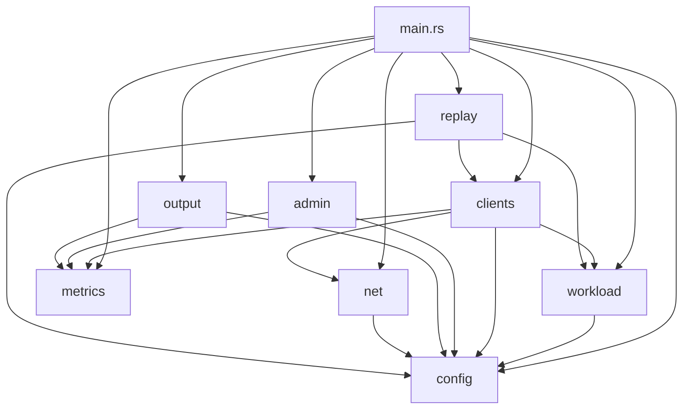
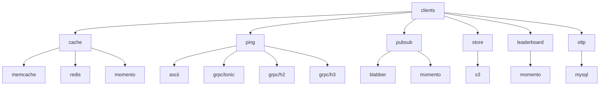

# rpc-perf Architecture Overview

## High-Level Module Dependency Diagram

## Module Descriptions

| Module | Description |
|--------|-------------|
| **config** | Handles TOML configuration parsing and validation, defining structures for all configurable aspects including protocols, targets, TLS settings, workloads, and output formats. |
| **workload** | Generates client requests based on configured distributions and patterns, managing ratelimiting and request orchestration across different protocol types. |
| **clients** | Contains protocol-specific client implementations (Memcache, Redis, Momento, S3, MySQL, gRPC ping variants, PubSub) that execute requests and record latency metrics. |
| **metrics** | Provides centralized metrics collection infrastructure using metriken, managing periodic snapshots for latency histograms and counters. |
| **net** | Abstracts network connectivity with TLS/SSL provider selection (BoringSSL or OpenSSL) and TCP connector configuration. |
| **admin** | Runs an HTTP server exposing metrics endpoints (`/metrics`, `/vars`, `/metrics.json`) and providing runtime ratelimit control via admin APIs. |
| **output** | Handles CLI display of statistics and file-based metrics export in multiple formats (Prometheus, JSON, Parquet, msgpack). |
| **replay** | Implements command log replay functionality, allowing traffic patterns to be recorded and replayed for reproducible benchmarking. |

## Clients Submodule Hierarchy

